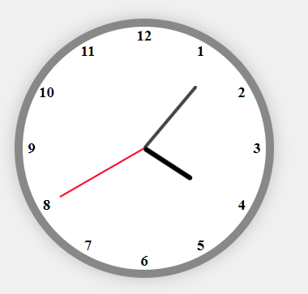

# 🕒 Analog Clock

A simple and elegant analog clock built using **HTML**, **CSS**, and **JavaScript**. The clock displays real-time hour, minute, and second hands, along with numbers arranged around the clock face.

---

## 🌟 Features

- Real-time updating hour, minute, and second hands
- Dynamically generated clock numbers (1–12)
- Responsive layout using Flexbox
- Styled with clean and minimal CSS
- No external libraries required

---

## 📁 Project Structure

analog-clock/
│
├── index.html # Main HTML file
├── style.css # CSS styles for the clock
├── script.js # JavaScript for clock functionality
└── README.md # Project documentation

---

## 🚀 How to Run

1. **Clone or download** the repository to your local machine.
2. Open `index.html` in any modern web browser (e.g., Chrome, Firefox).
3. You’ll see a functional analog clock in the center of your screen.

> 💡 No build steps or servers are needed. Just open the file in a browser.

---

## 🧠 How It Works

- The numbers (1–12) are generated dynamically using JavaScript and positioned in a circular layout using CSS `transform` with `rotate()` and `translate()`.
- The hour, minute, and second hands are updated every second based on the current time using `setInterval()`.
- Each hand is rotated based on calculated degree values derived from the current time.

---

## 🛠 Technologies Used

- **HTML5** – structure of the page
- **CSS3** – layout and styling
- **Vanilla JavaScript** – clock logic and DOM manipulation

---

## 📸 Preview

 <!-- Replace with actual screenshot if available -->

---

## 📄 License

This project is open-source and available under the [MIT License](LICENSE).

---

## 🙌 Acknowledgements

Created as a beginner-friendly project to demonstrate real-time DOM updates and CSS transformations.
